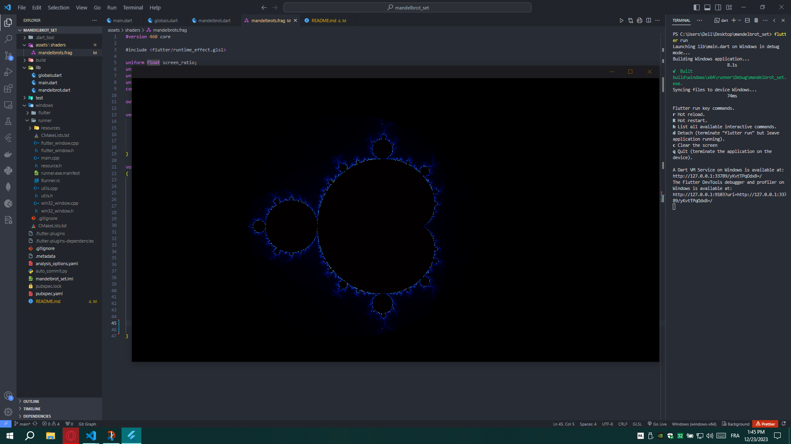

# Mandelbrot Set Visualization in Flutter 3.16.4

This Flutter application showcases a mesmerizing Mandelbrot Set visualization, harnessing the power of GPU programming through GLSL fragment shaders. The Mandelbrot Set, a renowned fractal, is rendered dynamically using the graphics capabilities of Flutter 3.16.4. Leveraging the flexibility and computational efficiency of GLSL (OpenGL Shading Language), the visualization algorithm is executed on the GPU, offering real-time generation of intricate fractal patterns. The interactive experience enables users to explore and navigate through the Mandelbrot Set, zooming in and out seamlessly to reveal the fascinating and infinitely complex structures inherent in this mathematical wonder.

    

